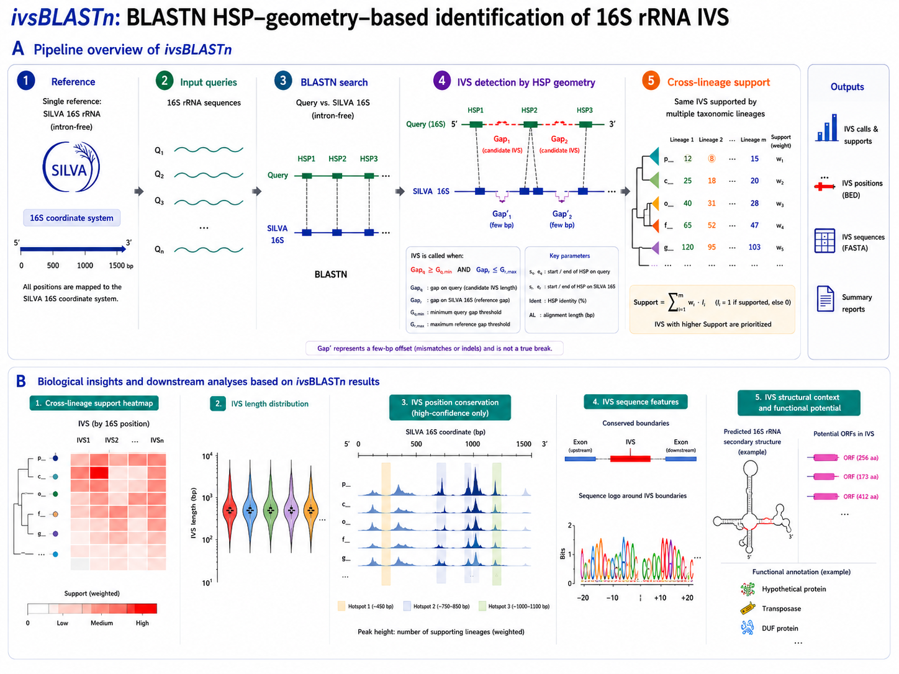

# ivsBLASTn

`ivsBLASTn` detects intervening sequences (IVSs) in 16S/SSU rRNA gene sequences using BLASTN HSP geometry.

The main evidence pattern is:

```text
query:    exon-left  [candidate IVS]  exon-right
subject:  exon-left  nearly continuous exon-right
```

In BLASTN output this appears as two HSPs on the query separated by a large query gap, while the subject-side coordinates remain adjacent or nearly adjacent.




## Install

Clone or download this repository, then install:

```bash
python -m pip install .
```

For development, install editable:

```bash
python -m pip install -e .
```

Check the command:

```bash
ivsBLASTn --help
ivsBLASTn run --help
```

## Update

From a git checkout:

```bash
git pull
python -m pip install -e .
```

If installed non-editably:

```bash
git pull
python -m pip install --upgrade .
```

## Requirements

Python dependencies are installed from `pyproject.toml`:

- `rich`
- `rich-argparse`

External tools are required when `ivsBLASTn` runs BLAST internally:

- `blastn`
- `makeblastdb`

Check them before a large run:

```bash
blastn -version
makeblastdb -version
```

If BLAST+ is not on `PATH`, pass explicit paths:

```bash
ivsBLASTn run ... \
  --blastn-bin /path/to/blastn \
  --makeblastdb-bin /path/to/makeblastdb
```

## Commands

```text
ivsBLASTn run           Run IVS detection on one query FASTA or one chunk
ivsBLASTn init-reference Prepare reusable reference FASTA, taxonomy TSV, and BLAST DB
ivsBLASTn split         Split a large query FASTA into chunks
ivsBLASTn submit-slurm  Generate and optionally submit a Slurm array job
ivsBLASTn merge         Merge per-chunk outputs
```

Old single-command usage is still accepted:

```bash
ivsBLASTn --query query.fa --db ref_db --outdir out
```

Internally this is treated as:

```bash
ivsBLASTn run --query query.fa --db ref_db --outdir out
```

## Reference Data

### Initialize A Reusable Reference From SILVA-Style FASTA

Use `--ref-fasta` when the reference FASTA header contains taxonomy after the sequence ID:

```text
>AB000393.1.1510 Bacteria;Pseudomonadota;...;Vibrio;Vibrio halioticoli
```

Initialize once:

```bash
ivsBLASTn init-reference \
  --ref-fasta SILVA_NR99.fa.gz \
  --outdir reference_silva_nr99 \
  --threads 8
```

This writes:

```text
reference_silva_nr99/
  raw_reference.fa
  raw_reference.tax.tsv
  raw_reference_db.*
  reference_manifest.tsv
```

Then reuse it:

```bash
ivsBLASTn run \
  --query query_16s.fa \
  --db reference_silva_nr99/raw_reference_db \
  --taxonomy reference_silva_nr99/raw_reference.tax.tsv \
  --outdir ivs_run \
  --threads 8
```

You can still initialize and run in one command:

```bash
ivsBLASTn run \
  --query query_16s.fa \
  --ref-fasta SILVA_NR99.fa.gz \
  --outdir ivs_run \
  --threads 8
```

Reference preprocessing rules:

1. Keep only domains in `--ref-domains`, default `Archaea,Bacteria`.
2. Normalize sequence text, convert `U` to `T`, and keep only non-empty `A/T/G/C` sequences.
3. Require a clear species name in the seventh taxonomy field.
4. Keep the longest `--ref-per-species` records per clear species, default `1`.
5. Records with unclear species names can still be retained as genus-level fallback references.
6. Keep the longest `--ref-unclear-per-genus` unclear-species records per genus, default `5`.

Clear species example:

```text
Vibrio halioticoli
```

Unclear species examples:

```text
Vibrio
Vibrio 1234
Vibrio sp001
```

These are not used as species-level representatives, but can be retained by the genus fallback if the genus field is available. To restore strict skipping of unclear species, use:

```bash
--ref-unclear-per-genus 0
```

When `--ref-fasta` is used directly in `ivsBLASTn run`, outputs under `outdir/reference/` include:

```text
raw_reference.fa
raw_reference.tax.tsv
raw_reference_db.*
```

### Starting From An Existing BLAST DB

Use this when you already have a curated reference DB:

```bash
ivsBLASTn run \
  --query query_16s.fa \
  --db reference_db_prefix \
  --taxonomy reference.tax.tsv \
  --outdir ivs_run \
  --threads 8
```

The taxonomy TSV should have two columns:

```text
subject_id<TAB>taxonomy
```

### Starting From An Existing BLAST Table

Use this when BLASTN was run externally:

```bash
ivsBLASTn run \
  --query query_16s.fa \
  --blast query_vs_reference.blastn.tsv \
  --taxonomy reference.tax.tsv \
  --outdir ivs_run
```

The BLAST table must be tab-delimited outfmt 6 with columns:

```text
qseqid sseqid pident length qstart qend sstart send evalue bitscore
```

## Key Parameters

For 16S/SSU IVS screening, these are usually the most important:

```bash
--top-subjects 100
--blast-max-hsps 5
--min-pident 75
--min-hsp-len 100
--min-intron-len 25
--max-intron-len 2000
--max-ref-gap 30
```

Query BLASTN uses:

```text
-max_target_seqs = --top-subjects
-max_hsps        = --blast-max-hsps
```

So the maximum reported HSP count per query is bounded by:

```text
--top-subjects * --blast-max-hsps
```

For IVS detection in 16S rRNA genes, IVSs are expected to be sparse, so the default `--blast-max-hsps 5` keeps BLAST output smaller than the earlier conservative value of 20.

## Single-Node Run

Recommended when the query FASTA is modest:

```bash
ivsBLASTn run \
  --query query_16s.fa \
  --db reference_db_prefix \
  --taxonomy reference.tax.tsv \
  --outdir ivs_run \
  --threads 8 \
  --top-subjects 100 \
  --blast-max-hsps 5
```

Output layout:

```text
ivs_run/
  blast/
    query_16s.vs_reference.blastn.tsv
  results/
    query_16s.summary.tsv
    query_16s.supporting_hsps.tsv
    query_16s.intron_free.fa
    query_16s.introns.fa
    query_16s.exons.bed
    query_16s.introns.bed
    query_16s.report.md
```

## Large Datasets And Slurm

For million-sequence query FASTA files, do not rely on one large `blastn -num_threads 96` process. BLASTN often does not scale linearly with CPU count.

The better strategy is query splitting:

```text
large query FASTA
  -> many chunk FASTA files
  -> Slurm array, one chunk per task
  -> merge outputs
```

The algorithm is query-independent, so splitting query records is safe. Each query is classified from its own BLAST HSPs, reference taxonomy, and parameters.

### 1. Split Query FASTA

```bash
ivsBLASTn split \
  --query all_16s.fa \
  --chunks-dir batch01/chunks \
  --chunk-size 5000
```

This writes:

```text
batch01/chunks/
  chunks.tsv
  query.000001.fa
  query.000002.fa
  ...
```

### 2. Generate Slurm Array Script

Dry run first. This writes a script but does not submit:

```bash
ivsBLASTn submit-slurm \
  --chunks-dir batch01/chunks \
  --db reference_db_prefix \
  --taxonomy reference.tax.tsv \
  --outdir batch01 \
  --threads 8 \
  --cpus-per-task 8 \
  --mem 16G \
  --time 12:00:00 \
  --array-concurrency 40
```

Detection parameters such as `--min-pident`, `--min-hsp-len`, `--min-intron-len`, `--max-ref-gap`, confidence thresholds, `--blast-task`, and `--blast-evalue` can be passed directly to `submit-slurm`. They are forwarded to every `ivsBLASTn run` array task, so local and Slurm runs can use the same thresholds.

Per-chunk run outputs are written directly under `--outdir` by default:

```text
batch01/
  slurm/
  query.000001/
    blast/
    results/
  query.000002/
    blast/
    results/
```

Use `--chunk-runs-dir some/path` if you want per-chunk run outputs somewhere else.

For commercial HPC platforms that require project accounting:

```bash
ivsBLASTn submit-slurm \
  --chunks-dir batch01/chunks \
  --db reference_db_prefix \
  --taxonomy reference.tax.tsv \
  --outdir batch01 \
  --threads 20 \
  --cpus-per-task 20 \
  --partition normal_fcp1 \
  --qos qos_prj_219_3 \
  --account prj_219_3 \
  --mem 32G \
  --time 24:00:00 \
  --array-concurrency 40
```

This writes:

```text
#SBATCH --partition=normal_fcp1
#SBATCH --qos=qos_prj_219_3
#SBATCH --account=prj_219_3
#SBATCH --cpus-per-task=20
```

Other platform-specific directives can be set with `--nodes`, `--ntasks`, `--constraint`, `--gres`, `--exclude`, `--nodelist`, or repeated `--sbatch-option`.

Review:

```text
batch01/slurm/ivsBLASTn_array.sbatch
```

Then submit manually:

```bash
sbatch batch01/slurm/ivsBLASTn_array.sbatch
```

Or submit directly:

```bash
ivsBLASTn submit-slurm \
  --chunks-dir batch01/chunks \
  --db reference_db_prefix \
  --taxonomy reference.tax.tsv \
  --outdir batch01 \
  --threads 8 \
  --cpus-per-task 8 \
  --mem 16G \
  --time 12:00:00 \
  --array-concurrency 40 \
  --submit
```

Typical starting points:

```text
chunk-size:          2,000-20,000 query records
threads/task:        8-16
cpus-per-task:       same as threads
array-concurrency:   20-100, depending on cluster policy
```

Prefer many moderate BLAST jobs over one 96-CPU BLAST job.

### 3. Merge Chunk Outputs

After all Slurm array tasks finish:

```bash
ivsBLASTn merge \
  --chunk-results-dir batch01 \
  --outdir batch01/final \
  --label all_16s
```

Merged files are written under:

```text
batch01/final/results/
  all_16s.summary.tsv
  all_16s.supporting_hsps.tsv
  all_16s.intron_free.fa
  all_16s.introns.fa
  all_16s.exons.bed
  all_16s.introns.bed
  all_16s.merge_report.md
```

Compressed chunk FASTA outputs are supported. If chunk runs use `--gzip-fasta-output`, `ivsBLASTn merge` writes merged `.fa.gz` files by concatenating valid gzip streams.

## Large Reference Data Strategy

Large references need a different strategy from large query files. Query splitting is simple because each query is classified independently. Reference splitting is more delicate because `--top-subjects`, taxonomic support, and nearest-neighbor evidence depend on the complete reference search space.

The safe strategy is to parallelize reference work in stages.

### Stage A: Parallel Reference Selection

Reference selection is based on:

```text
domain filter
ATGC-only filter
longest N records per species
longest M unclear-species records per genus
```

The "longest N per species" and "longest M unclear records per genus" rules are composable, so they can be parallelized exactly:

```text
raw SILVA FASTA
  -> split raw reference FASTA into shards
  -> each shard keeps local longest N per species and local longest M unclear records per genus
  -> concatenate local candidate records
  -> reduce again to global longest N per species and global longest M unclear records per genus
  -> build raw_reference.fa and raw_reference.tax.tsv
```

This is a true map-reduce operation. It is safe because the global top N longest records for a species or genus fallback group must be present in the union of each shard's local top N records for that group.

This is the recommended future optimization for very large SILVA-style FASTA files. It should be implemented as a dedicated reference-preparation workflow rather than by sharding the final BLAST database.

### Stage B: Build One Global Reference DB

After global reference selection, build one complete BLAST database:

```bash
makeblastdb \
  -in raw_reference.fa \
  -dbtype nucl \
  -out raw_reference_db
```

Do not build independent reference-shard databases for the final query search unless you also implement a second-stage global top-subject reduction. Otherwise each query's best subjects may be split across shards, and confidence support can be biased.

### Stage C: Parallel Reference Self-Cleaning

Reference self-cleaning treats reference records as queries against the complete reference DB. That means the query side of self-cleaning can be split safely:

```text
raw_reference.fa
  -> split into reference-query chunks
  -> Slurm array: each chunk vs raw_reference_db
  -> each chunk detects reference IVSs
  -> concatenate chunk intron_free.fa files
  -> build cleaned_reference_db
```

Conceptually:

```bash
ivsBLASTn split \
  --query reference_silva_nr99/raw_reference.fa \
  --chunks-dir refclean/chunks \
  --chunk-size 5000 \
  --chunk-prefix ref

ivsBLASTn submit-slurm \
  --chunks-dir refclean/chunks \
  --db reference_silva_nr99/raw_reference_db \
  --taxonomy reference_silva_nr99/raw_reference.tax.tsv \
  --outdir refclean \
  --threads 8 \
  --cpus-per-task 8 \
  --mem 16G \
  --time 12:00:00 \
  --array-concurrency 40 \
  --extra-run-args "--min-output-confidence LOW"

ivsBLASTn merge \
  --chunk-results-dir refclean \
  --outdir refclean/final \
  --label cleaned_reference

makeblastdb \
  -in refclean/final/results/cleaned_reference.intron_free.fa \
  -dbtype nucl \
  -out refclean/cleaned_reference_db
```

Then use:

```bash
ivsBLASTn run \
  --query query_16s.fa \
  --db refclean/cleaned_reference_db \
  --taxonomy reference_silva_nr99/raw_reference.tax.tsv \
  --outdir ivs_run
```

This works because each reference record's self-clean decision is query-local, but every chunk still searches against the same complete raw reference DB.

### What Not To Do

Avoid this as a first strategy:

```text
split reference DB into DB_1, DB_2, DB_3
query vs each DB shard
merge final IVS calls directly
```

That is not equivalent to a global BLAST search. To make reference DB sharding exact, you would need:

1. Query all reference shards.
2. Merge raw BLAST HSPs per query.
3. Re-rank subjects globally by bitscore.
4. Keep global `--top-subjects`.
5. Run IVS detection once on the globally reduced HSP set.

This can be implemented, but it is more complex than query-side splitting and should only be used if one complete reference DB is too large for BLAST+ on your cluster.

## Interpreting Results

Start with `*.summary.tsv`.

Important columns:

```text
query_id
classification
confidence
intron_start
intron_end
intron_len
support_subjects
support_taxa_at_genus
median_subject_gap
median_pident
best_subject
best_subject_taxonomy
reasons
```

Confidence tiers:

```text
HIGH    many supporting subjects and enough taxonomic spread
MEDIUM  multiple supporting subjects and taxa
LOW     at least one subject supports the HSP-gap pattern
NONE    no supported IVS signal
```

Review candidates by checking:

1. `support_subjects`: more independent subjects is stronger.
2. `support_taxa_at_genus`: support across genera is stronger than one narrow group.
3. `median_subject_gap`: values near 0 are best.
4. `median_pident`: should be reasonable for the reference distance.
5. `intron_len`: very short or near `--max-intron-len` needs manual inspection.
6. `*.supporting_hsps.tsv`: supporting HSP pairs should agree on breakpoint coordinates.

Output FASTA files:

```text
*.intron_free.fa   all query sequences; IVS removed only for candidates passing --min-output-confidence
*.introns.fa       candidate IVS sequences passing --min-output-confidence
```

BED files:

```text
*.introns.bed      candidate IVS intervals
*.exons.bed        exon intervals after IVS removal
```

## Algorithm Reference

### HSP Coordinates

For each BLAST HSP:

```text
qlo = min(qstart, qend)
qhi = max(qstart, qend)
slo = min(sstart, send)
shi = max(sstart, send)
qdir = +1 if qend >= qstart else -1
sdir = +1 if send >= sstart else -1
orientation = qdir * sdir
```

### HSP Prefiltering

An HSP is discarded before geometry analysis when:

```text
pident < --min-pident
length < --min-hsp-len
```

HSPs are grouped as:

```text
query_id -> subject_id -> list[HSP]
```

Subjects are ranked per query by total HSP bitscore:

```text
subject_score = sum(bitscore for all retained HSPs to that subject)
```

Only the top `--top-subjects` subjects are analyzed.

### Candidate HSP-Pair Geometry

Two HSPs are sorted by query coordinate:

```text
left, right = HSPs ordered by (qlo, qhi)
```

The candidate IVS interval is:

```text
query_gap = right.qlo - left.qhi - 1
intron_start = left.qhi + 1
intron_end   = right.qlo - 1
intron_len   = intron_end - intron_start + 1
```

Accepted query-side geometry:

```text
--min-intron-len <= query_gap <= --max-intron-len
--min-intron-len <= intron_len <= --max-intron-len
```

Subject-side continuity for same orientation:

```text
subject_gap = right.slo - left.shi - 1
```

Subject-side continuity for reverse orientation:

```text
subject_gap = left.slo - right.shi - 1
```

Accepted reference-side geometry:

```text
abs(subject_gap) <= --max-ref-gap
```

Pair score:

```text
pair_score = hsp1.bitscore + hsp2.bitscore - 2 * abs(subject_gap)
```

Each subject contributes at most one best HSP pair.

### Breakpoint Clustering

Support pairs are clustered by query-relative IVS coordinates:

```text
abs(pair.intron_start - median(cluster.intron_start)) <= --breakpoint-window
abs(pair.intron_end   - median(cluster.intron_end))   <= --breakpoint-window
```

Clusters are ranked by:

```text
1. number of supporting pairs
2. number of unique non-NA taxa at --tax-rank
3. sum(pair_score)
```

Final IVS coordinates are median coordinates from the best cluster.

### Confidence Rules

Default confidence thresholds:

| Confidence | Classification | Default rule |
| --- | --- | --- |
| `HIGH` | `HIGH_CONFIDENCE_16S_INTRON` | `support_subjects >= 10` and `support_taxa >= 3` |
| `MEDIUM` | `MEDIUM_CONFIDENCE_16S_INTRON` | `support_subjects >= 3` and `support_taxa >= 3` |
| `LOW` | `LOW_CONFIDENCE_16S_INTRON` | `support_subjects >= 1` |
| `NONE` | `NO_INTRON_SIGNAL` | no supported HSP-gap cluster |

The default `--tax-rank` is `genus`.

### Output Field Semantics

`*.summary.tsv` contains one row per query:

| Field | Meaning |
| --- | --- |
| `query_id` | Query FASTA ID |
| `query_len` | Query sequence length |
| `classification` | Confidence class label |
| `confidence` | `HIGH`, `MEDIUM`, `LOW`, or `NONE` |
| `intron_start`, `intron_end`, `intron_len` | Query-relative 1-based closed IVS interval |
| `exon1`, `exon2` | Query-relative exon intervals after IVS removal |
| `support_subjects` | Unique supporting subjects in the best cluster |
| `support_taxa_at_<rank>` | Unique taxa at selected rank |
| `median_subject_gap` | Median subject-side gap/overlap |
| `median_pident` | Median average identity across paired HSPs |
| `best_subject` | Highest-scoring support subject |
| `reasons` | Pipe-delimited algorithm metadata |

`*.supporting_hsps.tsv` contains one row per supporting subject pair in the best cluster.

## Known Limitations

- Input query sequences should already be SSU/16S sequences; `ivsBLASTn` does not extract rRNA genes from genomes.
- The method does not evaluate RNA secondary structure or splice motifs.
- Final IVS coordinates are query-relative, not reference-relative.
- Intron-containing references may align without a split HSP and therefore provide no support; use reference self-cleaning and enough `--top-subjects` when this is expected.
- Missing taxonomy reduces `support_taxa` and makes MEDIUM/HIGH confidence harder to reach.
- Gzip FASTA outputs are merged by concatenating gzip streams; most standard tools read this correctly.

## Troubleshooting

Missing BLAST+:

```text
FileNotFoundError: blastn
```

Install BLAST+ or pass `--blastn-bin`.

Too slow on large input:

```text
Use split + submit-slurm + merge.
Lower --chunk-size if tasks run too long.
Use 8-16 CPUs per task before trying 96 CPUs.
```

Huge BLAST output:

```text
Lower --top-subjects or --blast-max-hsps.
Defaults are --top-subjects 100 and --blast-max-hsps 5.
```

Few MEDIUM/HIGH calls:

```text
Provide --taxonomy.
Increase --top-subjects if reference may contain IVS-bearing near neighbors.
Inspect *.supporting_hsps.tsv before changing confidence thresholds.
```

## Development

Run tests:

```bash
python -m unittest discover -s tests
```

Run the package without installing:

```bash
python -m ivsblastn --help
```

Repository layout:

```text
ivsblastn/
  cli.py
  algorithm.py
  blast.py
  fasta.py
  reference.py
  split.py
  slurm.py
  merge.py
  outputs.py
  taxonomy.py
  models.py
tests/
figures/
```

## License

This project is released under the MIT License. See [LICENSE](LICENSE).
